## Exercice 1 (Tas binomiaux : gestion de priorité et union).

Soit la liste suivante :
[10, 1, 6, 12, 25, 8, 14, 29, 18, 11, 17, 38, 27]

Soit l'arbre binomial suivant :
<!--
10  -   1   -   6
       / \    / | \
     12   25 8 29  14
     |      /|  |
    18    11 17 38
           |
          27
-->

Firgure 1 : Arbre binomial
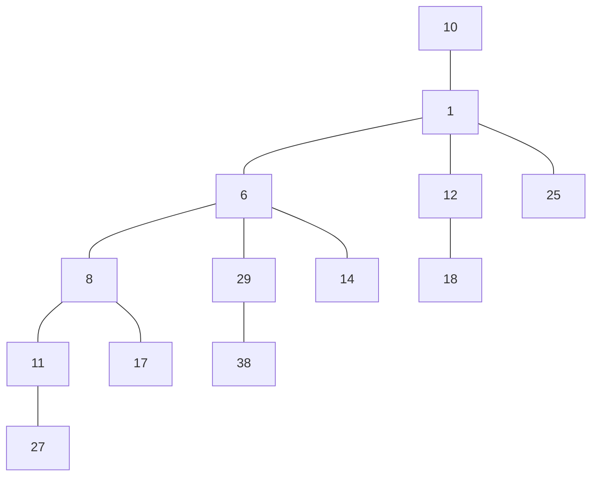

**Q1.1** Le arbre binomial ci-dessus correspond-il aux ajouts successifs par des Add des éléments du tableau :

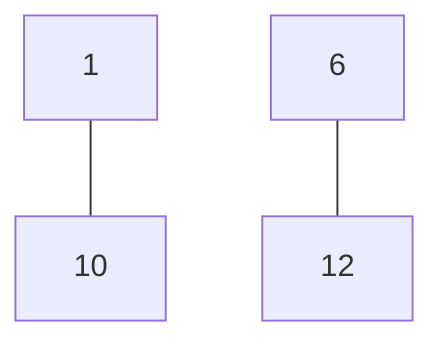
----------------------------------------------------------------------------------------------------------------------------
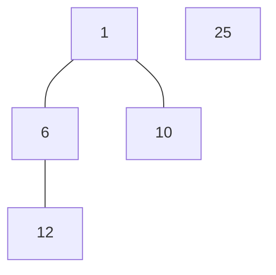
----------------------------------------------------------------------------------------------------------------------------

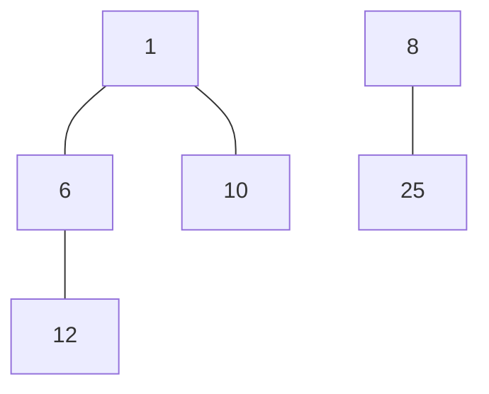
----------------------------------------------------------------------------------------------------------------------------

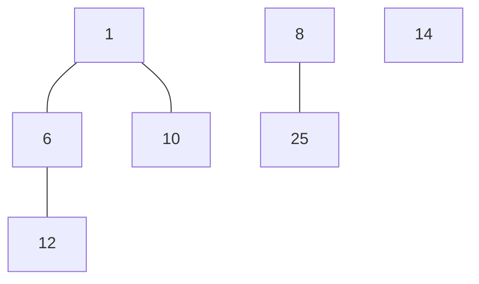
----------------------------------------------------------------------------------------------------------------------------

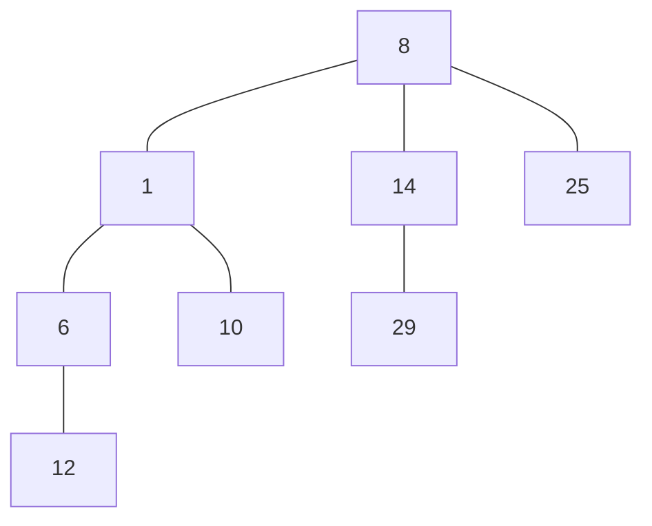
----------------------------------------------------------------------------------------------------------------------------

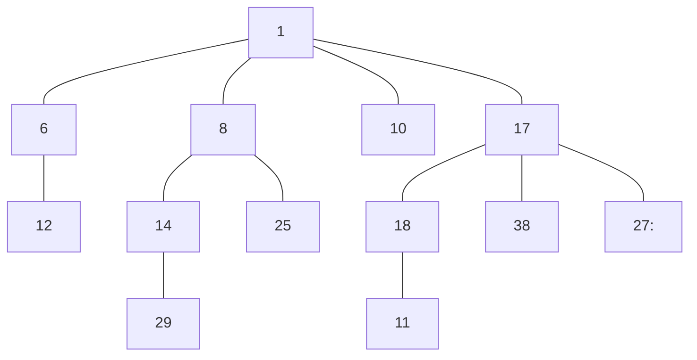
----------------------------------------------------------------------------------------------------------------------------


**Q.1.3** Dessiner le l'arbre binomial résultant de la suppression de l'élément 17 dans le arbre binomial de la Figure 1.
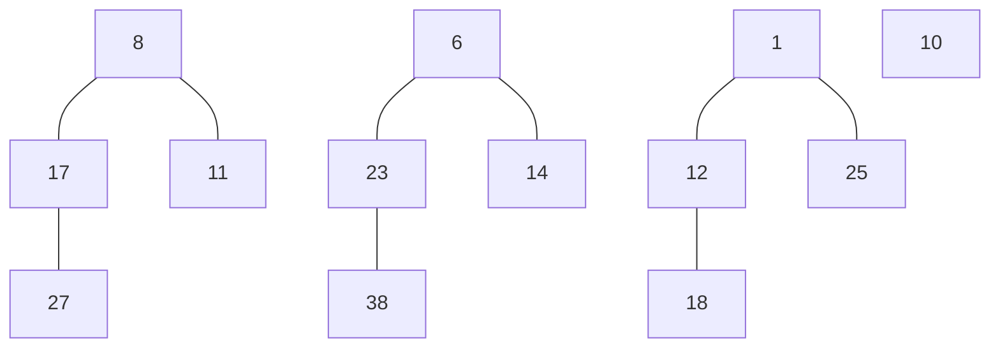
----------------------------------------------------------------------------------------------------------------------------

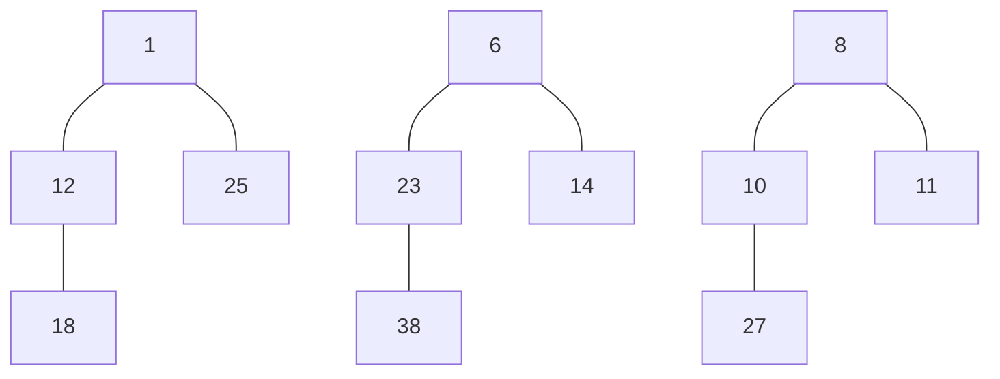
----------------------------------------------------------------------------------------------------------------------------

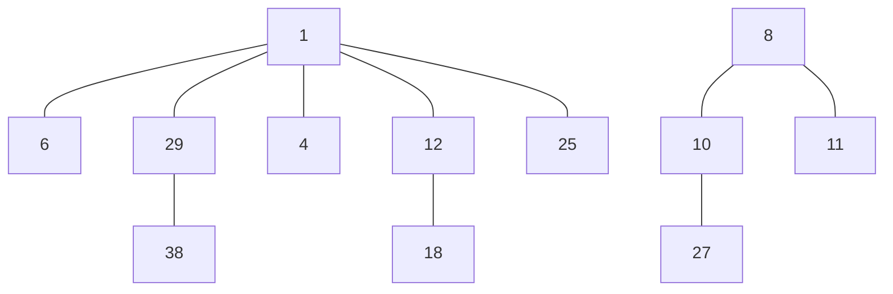
----------------------------------------------------------------------------------------------------------------------------

**Q1.4** Coder en binaire le nombre n d’éléments du tas binomial obtenu à la question précédente. Donner l'opération sur des nombres binaires qui a permis d'obtenir ce nombre binaire en vous servant de l'union de tas que vous avez réalisée lors de la question précédente.

12 éléments = 1100

$
1 * 2^3 + 1 * 2^2 + 0 * 2^1 + 0 * 2^0 = 12
\\
= 1100
$

## Exercice 2 (Arbres Binaires de Recherche : recherche d'information ).

**Q2.1.** Quel type de parcours (prefixe, infixe, postfix) faut-il effectuer pour obtenir les éléments d'un ABR dans l'ordre croissant ?
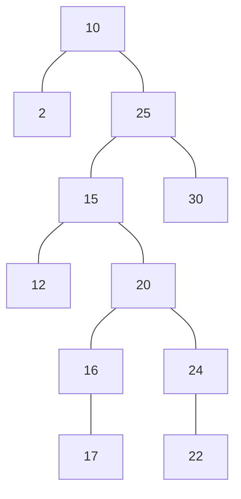
Le type de parcours qui permet d'obtenir les éléments d'un ABR dans l'ordre croissant est le parcours infixe.

**Q.2.2** L'algorithme TreeDelete(T ,z) rappelé ci-dessous supprime le nœud z dans l'arbre T , où Transplant(T , x, y) place le sous-arbre de racine y à la place de x dans T et TreeMinimum(x) renvoie le noeud contenant le minimum du sous-arbre de racine x :

```python
Procédure TreeDelete(T ; z) :

if left(z) = NIL then Transplant(T ; z; right(z))
else if right(z) = NIL then Transplant(T ; z; left(z))
else
    y ← TreeMinimum(right(z))
    if parent(y) 6 = z then
        Transplant(T ; y; right(y))
        right(y) ← right(z)
        parent(right(y)) ← y
    Transplant(T ; z; y)
    left(y) ← left(z)
    parent(left(y)) ← y
```
Mettre en oeuvre l'aglo. ci-dessus sur l'abre ci-dessous :

----------------------------------------------------------------------------------------------------------------------------
TreeDelete(24) :
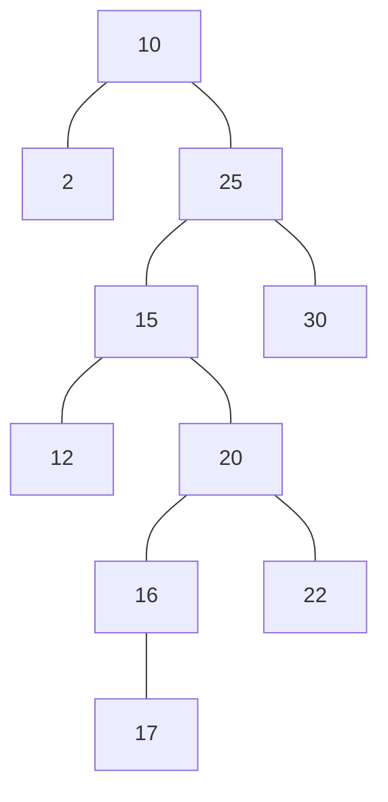
----------------------------------------------------------------------------------------------------------------------------
TreeDelete(15) :
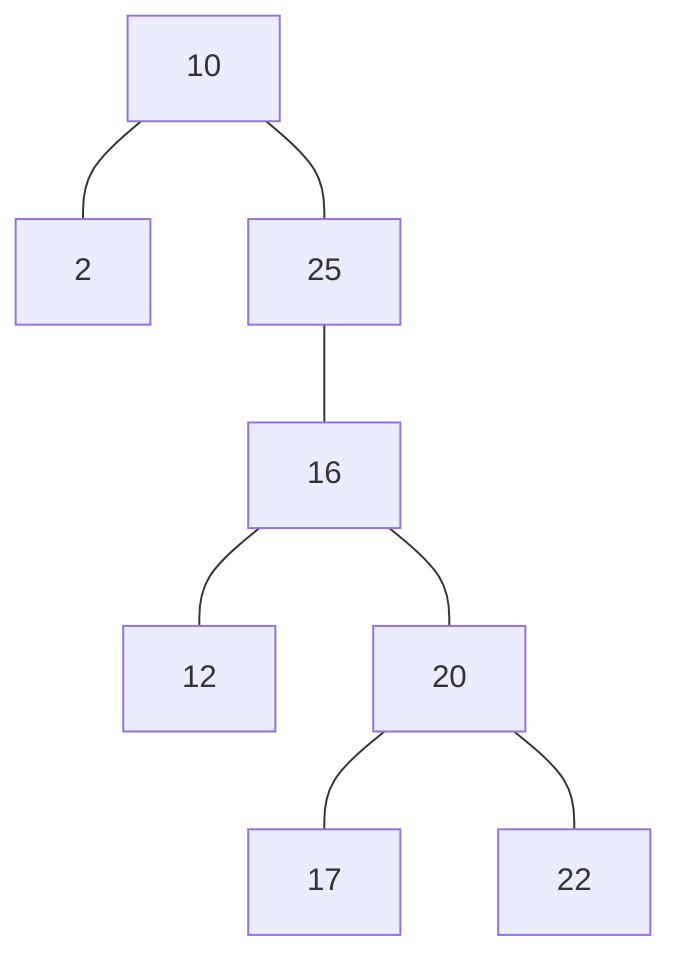