## Exercice 1 (Tas binomiaux : gestion de priorité et union).

Soit la liste suivante :
[10, 1, 6, 12, 25, 8, 14, 29, 18, 11, 17, 38, 27]

Soit l'arbre binomial suivant :

<!--
10  -   1   -   6
       / \    / | \
     12   25 8 29  14
     |      /|  |
    18    11 17 38
           |
          27
-->

Firgure 1 : Arbre binomial

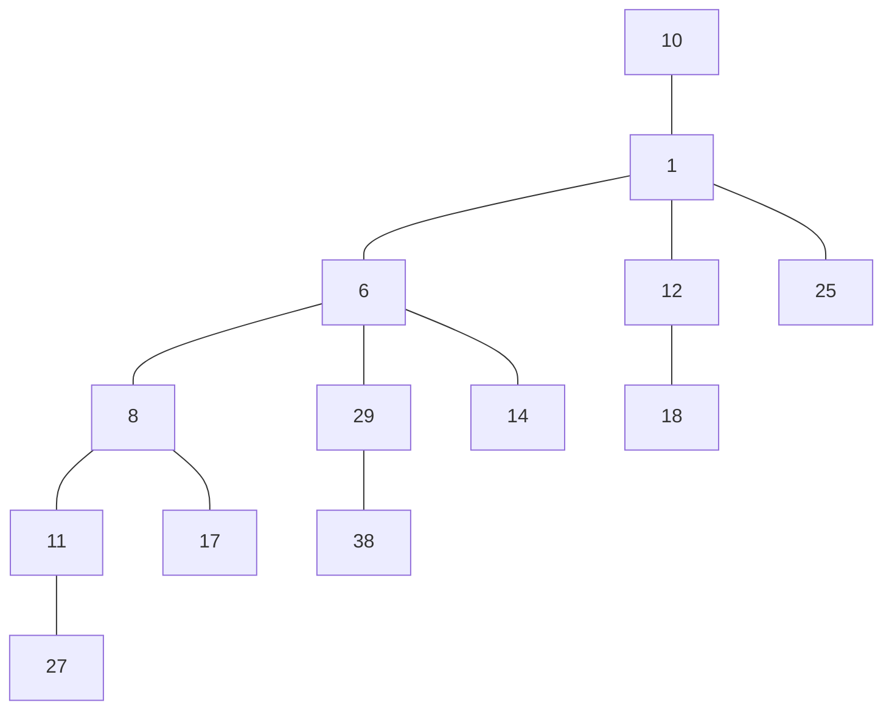

**Q1.1** Le arbre binomial ci-dessus correspond-il aux ajouts successifs par des Add des éléments du tableau :

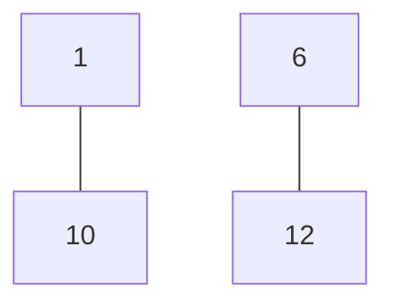

---

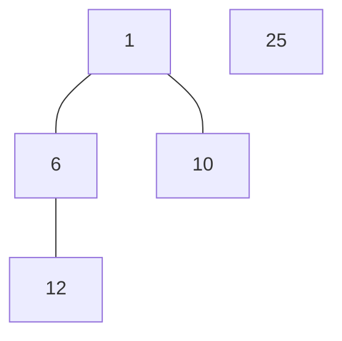

---

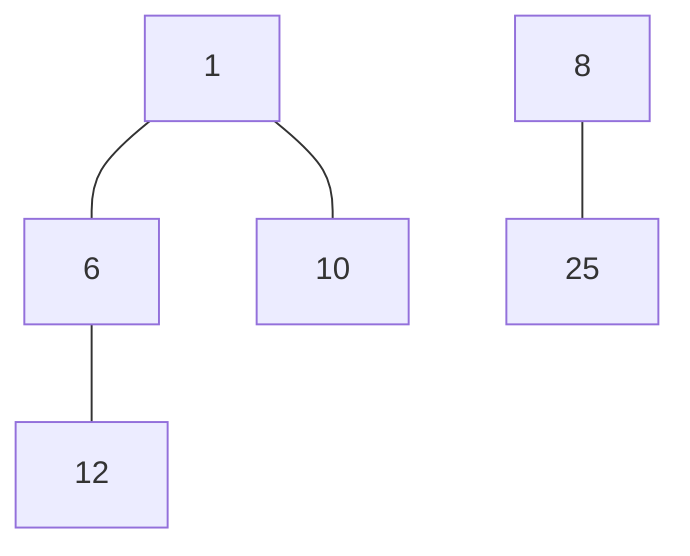

---

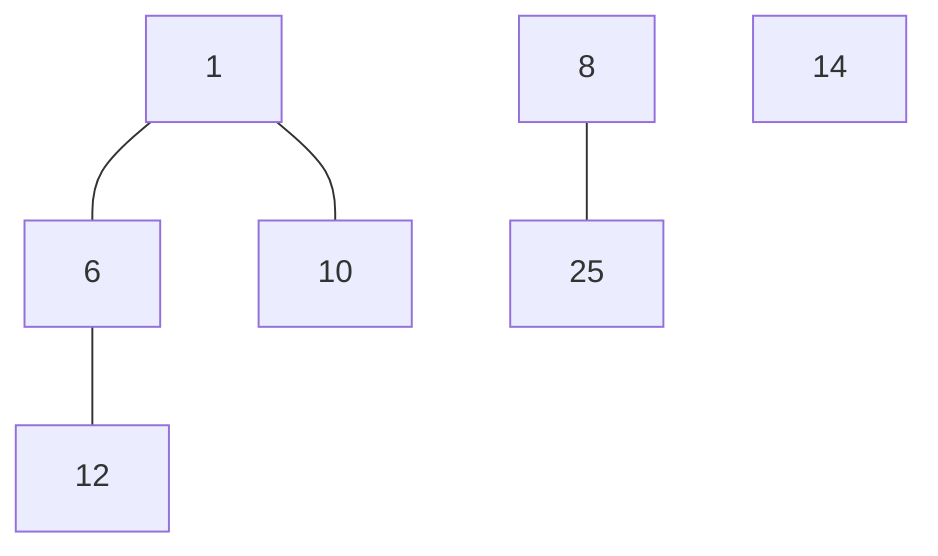

---

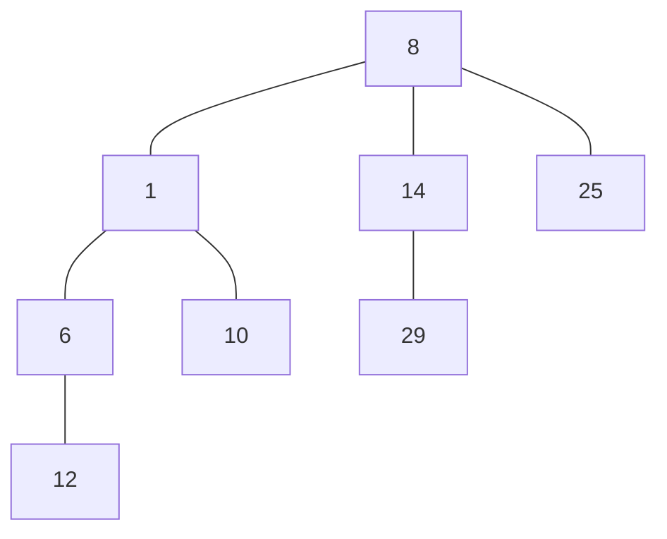

---

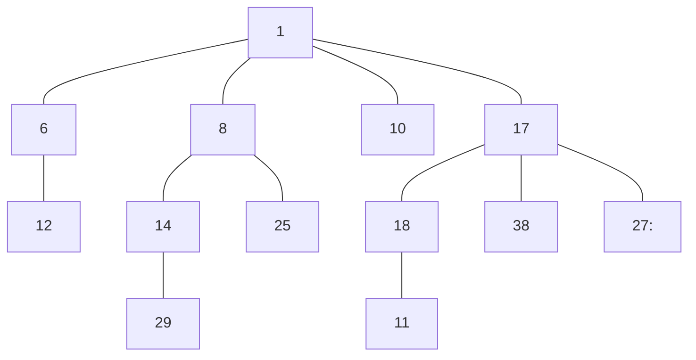

---

**Q.1.3** Dessiner le l'arbre binomial résultant de la suppression de l'élément 17 dans le arbre binomial de la Figure 1.

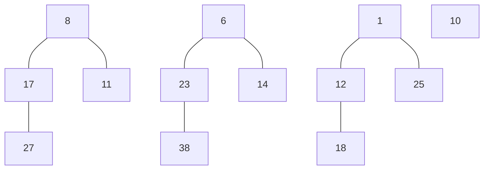

---

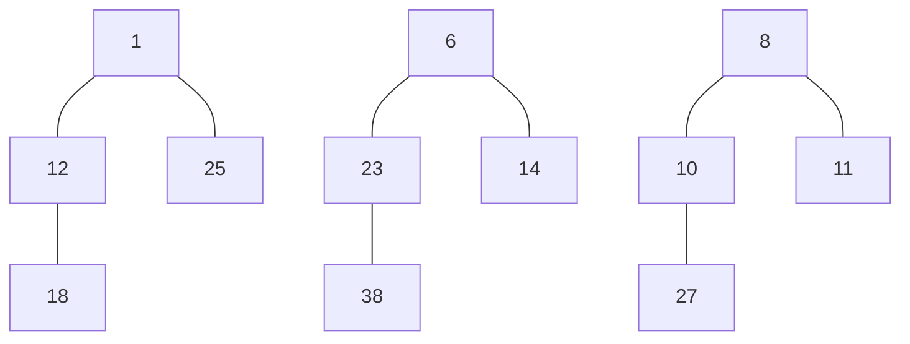

---

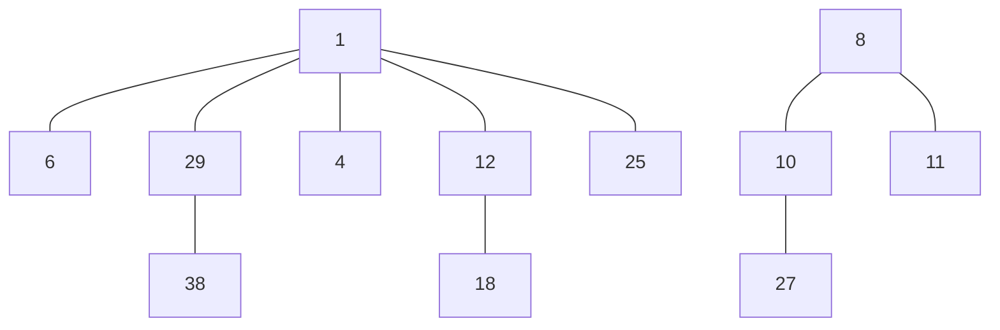

---

**Q1.4** Coder en binaire le nombre n d'éléments du tas binomial obtenu à la question précédente. Donner l'opération sur des nombres binaires qui a permis d'obtenir ce nombre binaire en vous servant de l'union de tas que vous avez réalisée lors de la question précédente.

12 éléments = 1100

$
1 * 2^3 + 1 * 2^2 + 0 * 2^1 + 0 * 2^0 = 12
\\
= 1100
$

## Exercice 2 (Arbres Binaires de Recherche : recherche d'information ).

**Q2.1.** Quel type de parcours (prefixe, infixe, postfix) faut-il effectuer pour obtenir les éléments d'un ABR dans l'ordre croissant ?

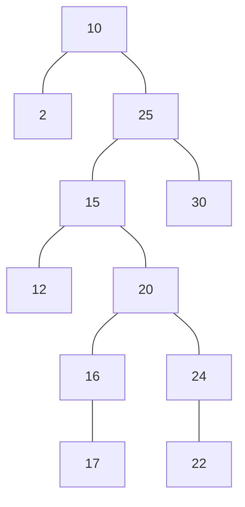

Le type de parcours qui permet d'obtenir les éléments d'un ABR dans l'ordre croissant est le parcours infixe.

**Q.2.2** L'algorithme TreeDelete(T ,z) rappelé ci-dessous supprime le nœud z dans l'arbre T , où Transplant(T , x, y) place le sous-arbre de racine y à la place de x dans T et TreeMinimum(x) renvoie le noeud contenant le minimum du sous-arbre de racine x :

```python
Procédure TreeDelete(T ; z) :

if left(z) = NIL then Transplant(T ; z; right(z))
else if right(z) = NIL then Transplant(T ; z; left(z))
else
    y ← TreeMinimum(right(z))
    if parent(y) 6 = z then
        Transplant(T ; y; right(y))
        right(y) ← right(z)
        parent(right(y)) ← y
    Transplant(T ; z; y)
    left(y) ← left(z)
    parent(left(y)) ← y
```

Mettre en oeuvre l'aglo. ci-dessus sur l'abre ci-dessous :


---

TreeDelete(24) :

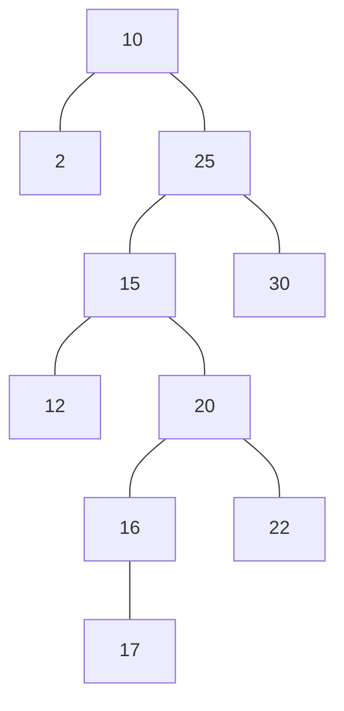

---

TreeDelete(15) :

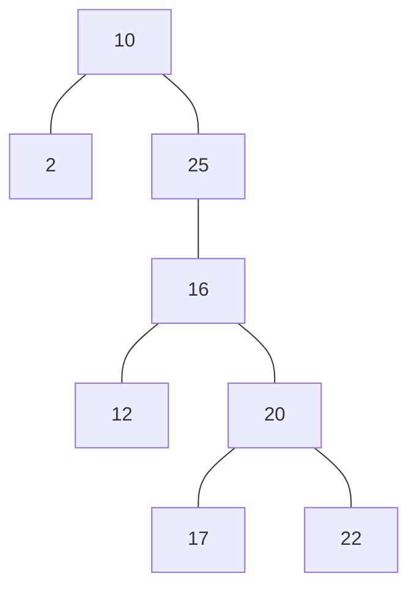

## Exercice 3 (Arbres AVL) :

**Q3.1** L'arbre de la question 1 est-il un AVL ? sinon le modifier par des rotations simples.


### Nous allons equilibrer l'arbre en utilisant les rotations simples.

#### Etape 1

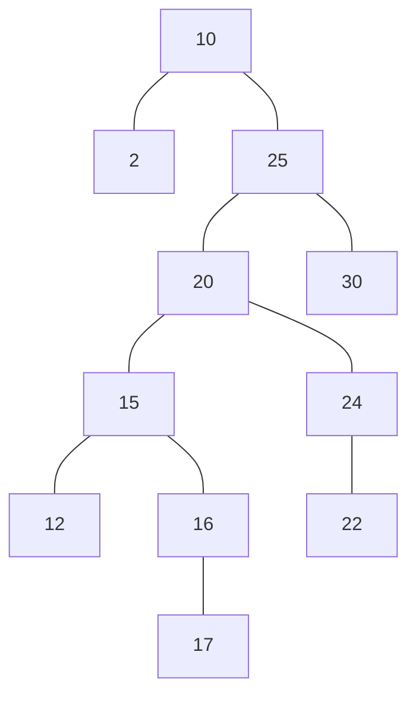

---

#### Etape 2

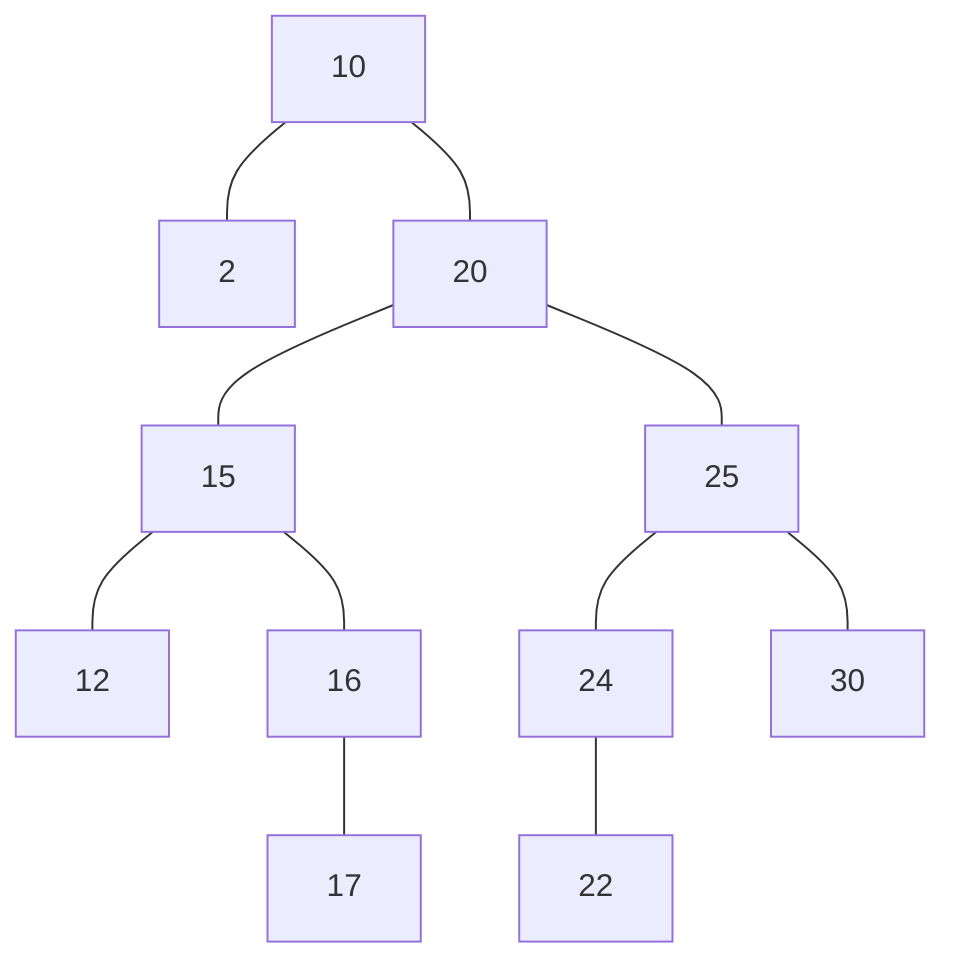

---

#### Etape 3

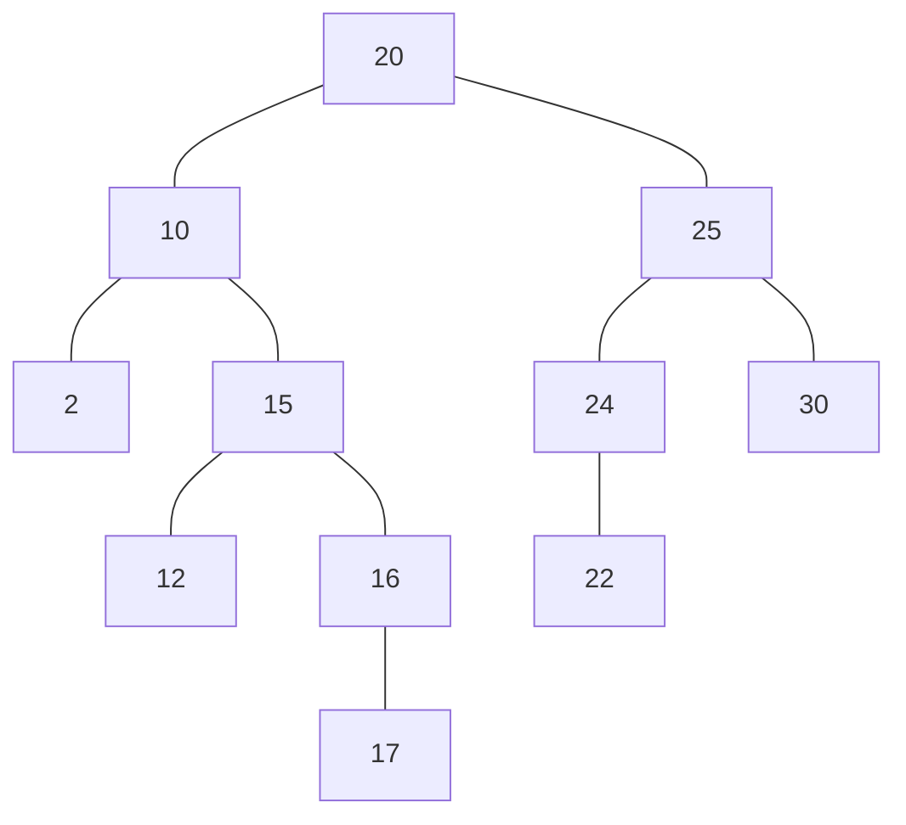

---

#### Etape 4

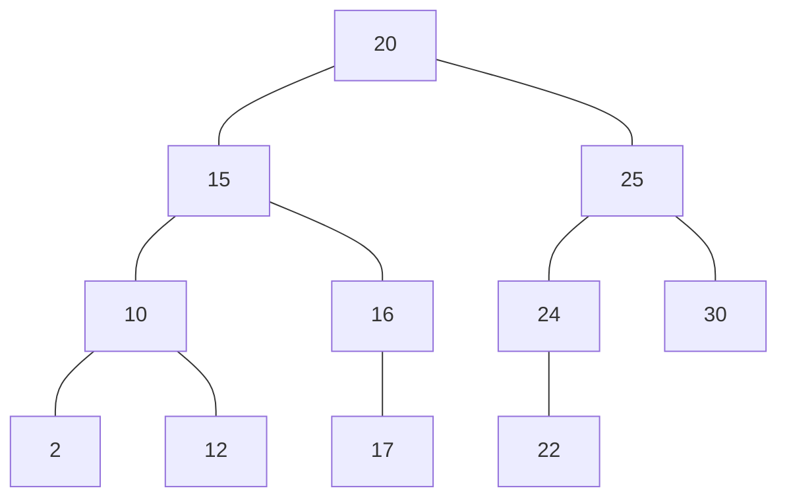

**Q3.2** Proposez une valeur à insérer dans l'AVL trouvé à la question précédente qui fait perdre à l'arbre la propriété des AVL.

Insertions qui déséquilibre l'arbre :

- 23 ou 21 déséquilibre l'arbre en 25.
- 18 déséquilibre l'arbre en 16.

**Q3.3** Après une insertion dans un AVL, on doit remonter en direction de la racine jusqu'au premier nœud s'il existe (sinon l'arbre reste un AVL et on a fini) dont les hauteurs des sous arbre gauche et droit diffèrent de 2. Considérons le cas d'une insertion d'un noeud w dans le sous-arbre T1 de la figure ci-dessous telle que le premier noeud qui viole la propriété d'AVL est x, avec T4 de hauteur h. En utilisant le fait que l'arbre était un AVL avant l'insertion, déduire les hauteurs de y, x, z, T1, T2 et T3 avant et après.

hy = h + 1 :

- avant insertion = equilibré $|hy -h| \leq 1$
- aprés insertion = déséquilibré $|hy -h| > 1$

Si hy > h (avant insertion) l'ajout de w ne deséquilibre pas l'arbre.

=> hy = h + 1

=> max(hy, hz) = h : On doit avoir hz = h (avant insnertion) car si hz = h + 1 l'ajout de w ne changerait pas hy.

On a $hz \in \{h, h - 1\} $, mais si hz = h - 1 ; deséquilibre l'arbre en y aprés insertion. ça n'est pas le cas -> hz = h

max(h1, h2) = h - 1 Moyennant raissonnement similaire que précédemment, on peut déduire que h1 = h2 = h - 1.

Finalement, on a : hx = 1 + max(h, hy) = h + 2

Aprés insertion :

    h'1 = h, h'2 = h - 1 (inchanger), h'z = h + 1, h'3 = h3 = h, h'y = h + 2, h'x = h + 3

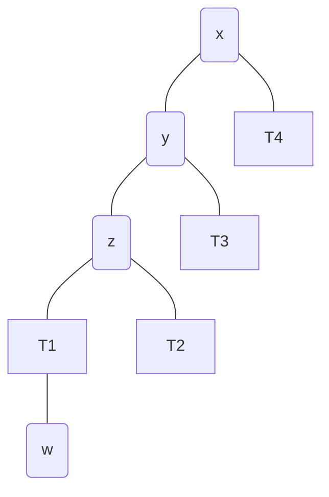

**Q3.4** Aprés rotation en x : h"z = h + 1

```mermaid
graph TD;
    2(y)---3(z);
    2(y)---1(x);
    3---T1;
    3---T2;
    1---T3;
    1---T4;
```

## Exercice 4 (B-arbres : structure compacte pour la recherche d'information) :

**Q4.1** Donnez le B-Tree de degré minimum t = 3 résultant de l'insertion successive des lettres A,L,G,O,R,I,T,H,M,S,U,P. Vous détaillerez les passages d'éclatement des noeuds. Entre 2 et 4 clefs a chaque noeud. $[m/2] = 3 => m = 5 $ ordre m entre [m/2] et m enfants.

    A, L
        -> [A, L, _, _]

    + G
        -> [A, G, L, _]

    + O
        -> [A, G, L, O]

    + R
        -> [L, _, _, _]
            /       \
    [A, G, _, _]  [O, R, _, _]

    + I
        -> [L, _, _, _]
            /       \
    [A, G, I, _]  [O, R, _, _]

    + T
        -> [L, _, _, _]
            /       \
    [A, G, I, _]  [O, R, T, _]

    + H
        -> [L, _, _, _]
            /       \
    [A, G, H, I]  [O, R, T, _]

    + M
        -> [L, _, _, _]
            /       \
    [A, G, H, I]  [M, O, R, T]

    + S
        -> [L, R, _, _]
        /           |       \
    [A, G, H, I] [M, O, _, _] [S, T, _, _]

    + U
        -> [L, R, _, _]
        /           |           \
    [A, G, H, I] [M, O, _, _] [S, T, U, _]

    + P
        -> [L, R, _, _]
        /           |           \
    [A, G, H, I] [M, O, P, _] [S, T, U, _]

**Q4.2** Donnez, en fonction du degré minimum t, le nombre maximum et minimum de clés qui peuvent être stockées dans un B-Tree de hauteur h. En déduire une expression asymptotique de la hauteur h(n) en fonction du nombre n de clefs contenues dans un B-Tree

$ 1 + x + x^2 + ... + x^n = \frac{1-x^{n+1}}{1-x} $

- nombre maximum de clés = $\frac{1-2t^{h+1}}{1-2t} = (2t)^{h+1} - 1$
- nombre minimum de clés = $1 + t(t-1) \frac{1-t^{h}}{1-t} = 1 + t^{h + 1} - t$
