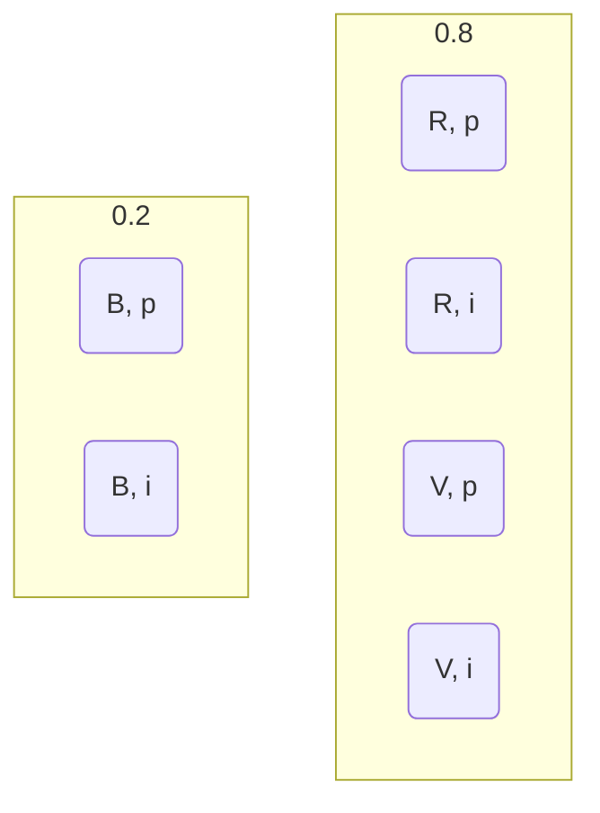
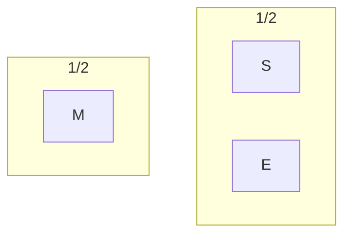
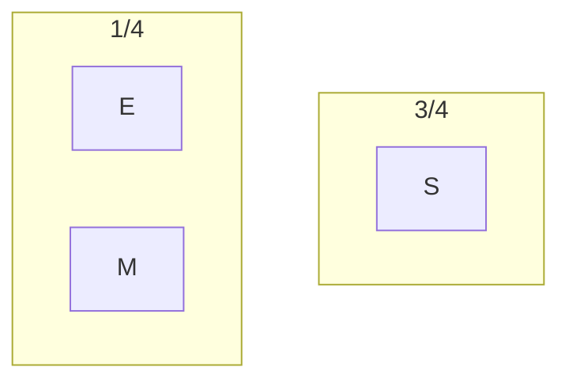
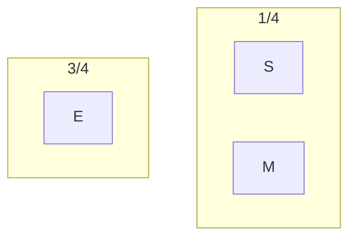

# KRR1 Feuille de TD n°3: Incertitude

## 1. Des paris "à 20 balles"

Une urne contient 20 balles. Les balles sont verte (v), bleues (b) ou rouges (r) et portent des numeris différents (elles sont numeritées de 1 à 20).

On propose à un parieur les paris suivants sur la couleur et le numéro de la balle qui va étre tirée:

- Paris A: Gagner 10 si la balles est rouge, rien sinon.
- Paris B: Gagner 10 si la balles porte un numero pair, 0 sinon.
- Paris C: Gagner 5 si la balles est rouge, 2 si elle est bleue, 0 sinon.
- Paris D: Gagner 5 si la balles porte un numero pair, 1 si son numéro est impair.
- Paris E: Gagner 3 si la balles est rouge ou verte, 0 sinon.

Soit:

|         | (R, p) | (R, i) | (B, p) | (B, i) | (V, p) | (V, i) |
| :-----: | :----: | :----: | :----: | :----: | :----: | :----: |
| Paris A |   10   |   10   |   0    |   0    |   0    |   0    |
| Paris B |   10   |   0    |   10   |   0    |   10   |   0    |
| Paris C |   5    |   5    |   2    |   2    |   0    |   0    |
| Paris D |   5    |   1    |   5    |   1    |   5    |   1    |
| Paris E |   3    |   3    |   0    |   0    |   3    |   3    |

### 1.1. Calculer les valeurs de l'espérance et de l'incertitude de chaque paris.

F = {P, P(R) = 0.2 et P(B) = $\frac{1}{2}$} \
 = {P, P(B, p) + P(B, i) = 0.2 et P(B, p) + P(R, p) = $\frac{1}{2}$}

u(x) = x \
UE(Paris A) = $inf_{P \in F}$ P(R, i) \* 10 + P(R, p) \* 10 + P(B, p) \* 0 + P(B, i) \* 0 + P(V, p) \* 0 + P(V, i) \* 0 \
 = $inf_{P \in F}$ P(R, i) \* 10 + P(R, p) \* 10 = 0 \
UE(Paris B) = $inf_{P \in F}$ P(R, i) \* 0 + P(R, p) \* 10 + P(B, p) \* 10 + P(B, i) \* 0 + P(V, p) \* 10 + P(V, i) \* 0
UE(Paris C) = $inf_{P \in F}$ P(R, i) \* 5 + P(R, p) \* 5 + P(B, p) \* 2 + P(B, i) \* 2 + P(V, p) \* 0 + P(V, i) \* 0 \
UE(Paris D) = $inf_{P \in F}$ P(R, i) \* 5 + P(R, p) \* 1 + P(B, p) \* 5 + P(B, i) \* 1 + P(V, p) \* 5 + P(V, i) \* 1 \
UE(Paris E) = $inf_{P \in F}$ P(R, i) \* 3 + P(R, p) \* 3 + P(B, p) \* 0 + P(B, i) \* 0 + P(V, p) \* 3 + P(V, i) \* 3 \

### 1.2. Utilité ésperée.

UE(Paris A) = $inf_{P \in F}$ P(R, i) \* 10 + P(R, p) \* 10 = 0

UE(Paris C) = $inf_{P \in F}$ P(V, i) \* 0 + P(B, p) \* 2 = 0.2 \* 2

## 3. Immobilier locatif

| Population/Logement | Appartements | Villas |
| :-----------------: | :----------: | :----: |
|          E          |     200      |   0    |
|          M          |     300      |  220   |
|          S          |      30      |  400   |

CM:

$$
    m_1 : \\
    m_1(\{M\}) = \frac{1}{2} \\ m_1(\{S, E\}) = \frac{1}{2} \\
    Bel(\{S\}) = 0 ~~ Pl(\{S\}) = \frac{1}{2} \\
    Bel(\{S, M\}) = \frac{1}{2} ~~ Pl(\{S, M\}) = 1  \\
    Bel(\{S, M, E\}) = 1 = Pl(\{S, M, E\}) \\
$$

Quand le cabinet conseille CE, on considere la fonction de masse $m(\{M\}) = \frac{1}{2}$ et $m(\{S, E\}) = \frac{1}{2}$

$$
    U_{pess}(A_{pp}) = 0.5 * 300 + 0.5 * min(200, 30) = 165 \\
    U_{pess}(Villas) = 0.5 * 220 + 0.5 * min(400, 0)  = 110 \\
$$

CS:

Quand le cabinet conseille CE, on considere la fonction de masse $m(\{S\}) = \frac{3}{4}$ et $m(\{E, M\}) = \frac{1}{4}$

$$
    U_{pess}(A_{pp}) = 0.75 * 30 + 0.25 * min(200, 300) = 72.5 \\
    U_{pess}(Villas) = 0.75 * 400 + 0.25 * min(0, 220)  = 300 \\
$$

CE:

$$
    m_3 : \\
    Bel({S}) = \Sigma^A_{A \in \{S\}} m_3(A) = 0  \\
    Pl({S}) = \Sigma^A_{A \cap \{S\} \neq 0} m_3(A) = \frac{1}{4}
$$

Quand le cabinet conseille CE, on considere la fonction de masse $m(\{E\}) = \frac{3}{4}$ et $m(\{M, S\}) = \frac{1}{4}$

$$
    U_{pess}(A_{pp}) = 0.75 * 200 + 0.25 * min(300, 30) = 165 \\
    U_{pess}(Villas) = 0.75 * 0 + 0.25 * min(220, 400)  = 55 \\
$$
