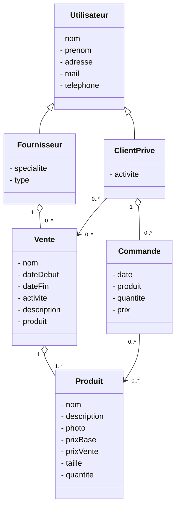
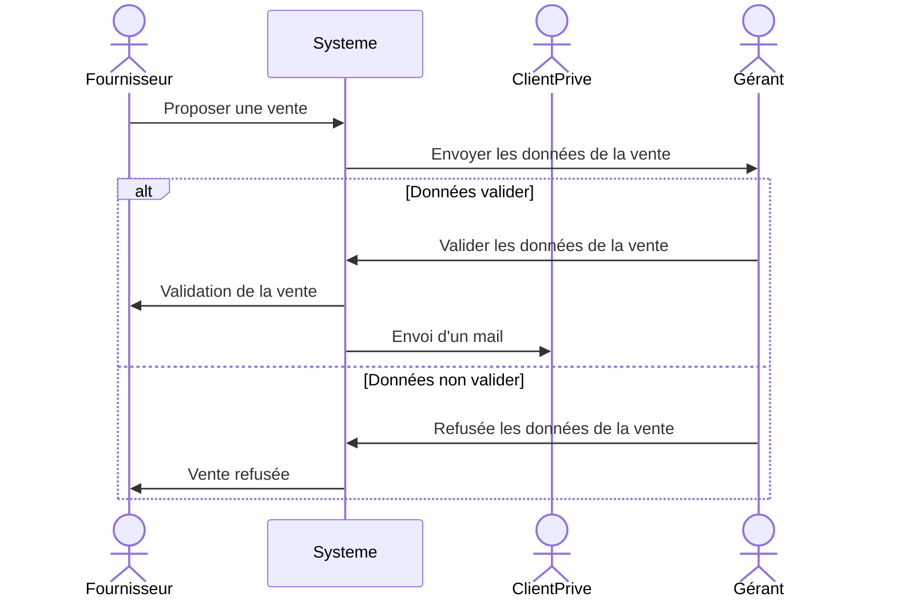
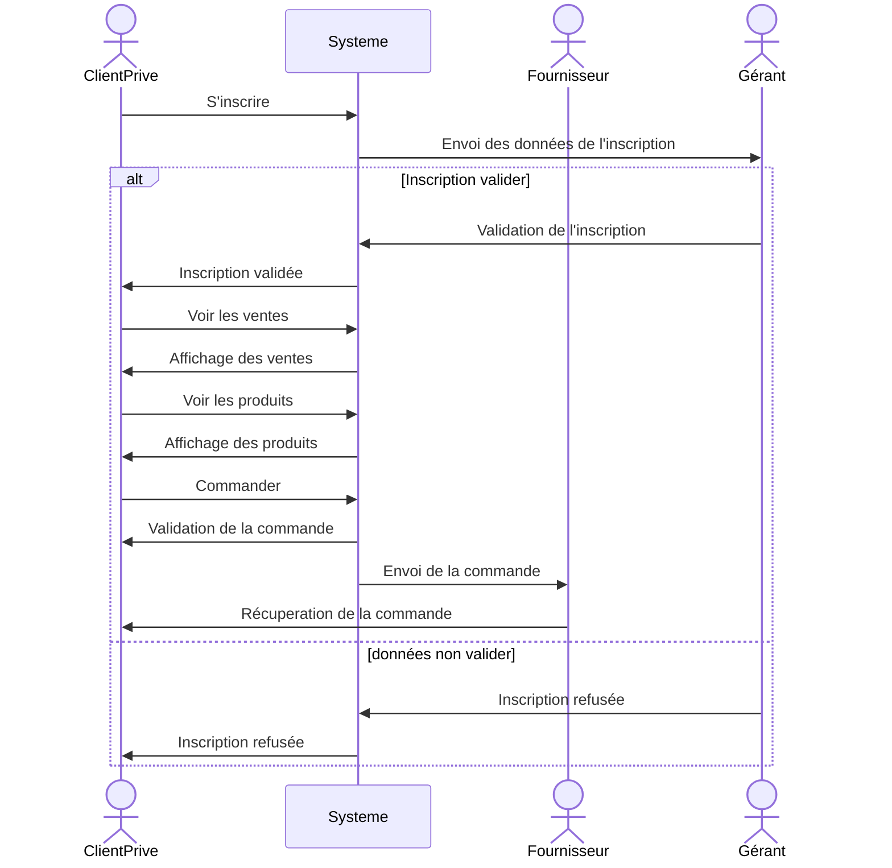

<!-- Le sujet portera sur la modélisation d'une application pour gérer un magasin de vente AllBoardsShop.

Le magasin AllBoardsShop spécialisé dans la vente de matériels de « sport de glisse » (surf, snow, skate and co.) souhaite moderniser son commerce en proposant à des clients privilégiés des ventes privées, adaptées à leurs activités.

Un client privilégié est un client sélectionné par le magasin qui confirme son intérêt pour les ventes par une inscription. Ces ventes proposeront aux clients privilégiés des articles invendus par les fournisseurs habituels du magasin à des prix réduits.

Pour cela, le magasin souhaite permettre à ces clients privilégiés de s'inscrire à ces ventes à chaque fois qu'elles correspondront à leur activité.

Le client privilégié devra pouvoir s'inscrire en déterminant :

- ses informations personnelles : nom, prénom, adresse postale et mail,
  éventuellement le numéro de téléphone ;
- les activités qu'il privilégie (surf, skate, snowboard, wakeboard, funboard, etc.).

Les fournisseurs de matériel devront pouvoir proposer des ventes ; il faut donc gérer les données de ces fournisseurs. Ainsi, pour chacun d'eux, il est utile de connaître :

- ses informations personnelles : nom, adresse postale, mail et numéro de téléphone
- la spécialité de son activité (matériels de surf, ski, snow, etc.) ;
- le type de matériel qu'il fournit:
  « hard goods » : supports physiques (ex : une planche, des fixations, une voile...) ;
  « soft goods » : produits indirects (ex : vêtements, accessoires...) ;
- les ventes qu'il propose.

Pour chacune des ventes, le fournisseur définit les informations suivantes sur chacun de ses produits :

- nom ;
- description technique ;
- photo ;
- prix de base, prix de vente ;
- les tailles proposées et la quantité du produit proposé dans chaque taille.

En ce qui concerne la vente en elle-même , les informations pertinentes sont:

- nom ;
- date de début et de fin ;
- la ou les activités auxquelles elle se rapporte ;
- un descriptif détaillé ;
- les produits mis en vente.

L'objectif est d'automatiser le plus possible la mise en relation entre le client privilégié et les ventes susceptibles de l'intéresser. Ainsi, pour chaque nouvelle vente proposée par un fournisseur, le système devra en informer les clients privilégiés dont les activités correspondent à la vente, via un envoi de mail personnalisé.

Les fournisseurs peuvent proposer une vente au système, modifier leurs informations et bien entendu, récupérer les commandes liées aux ventes qu'ils ont proposées pour livrer le magasin.

Pour qu'un client sélectionné puisse être averti d'une nouvelle vente et puisse participer aux ventes, il doit s'inscrire en tant que client privilégié et entrer les informations le caractérisant. Par la suite, il peut changer ses caractéristiques. Le gérant du magasin est responsable de la sélection des noms des clients qu'il veut privilégier et valide ensuite leur inscription.

Un fournisseur peut proposer une vente en en donnant une description. Celle-ci est ensuite validée par le gérant du magasin après en avoir consulté la nature et les quantités mises en vente. Cette validation déclenche l'avertissement des clients privilégiés.

À la date définie, la vente démarre ; les clients privilégiés qui se sont préalablement inscrits à la vente peuvent alors prendre connaissance des produits vendus et constituer leur choix. Le paiement de leur commande valide l'opération et fournit une date de livraison.

Le système à concevoir doit prendre en compte toute la gestion de vente privée décrite précédemment. Pour le paiement, un système externe tel que Paypal sera utilisé. -->

## Diagramme de classe.

## Diagramme de séquence détailler d'un fournisseur proposant une nouvelle vente au systeme.

## Diagramme de séquence détailler d'un client privilégié lorsqu'il fait un achat lors d'une vente privée.

