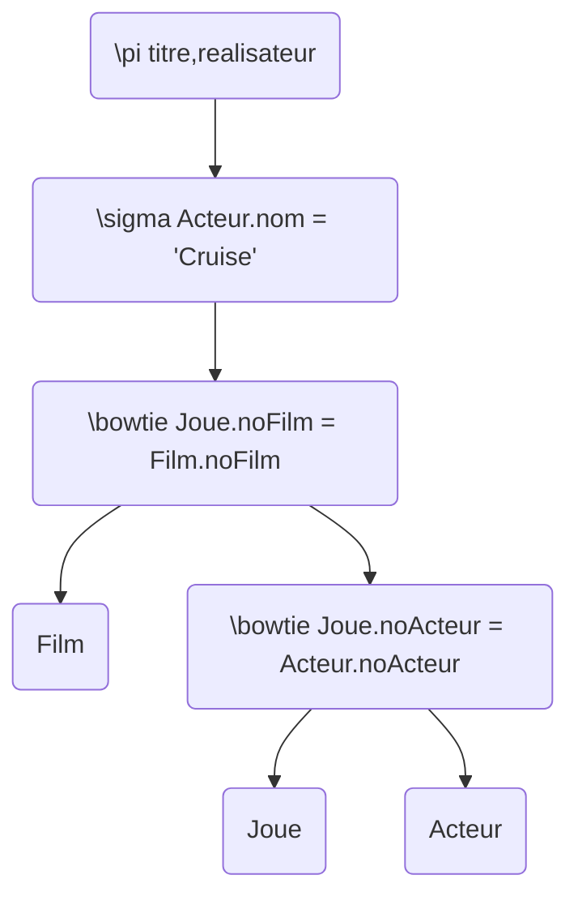
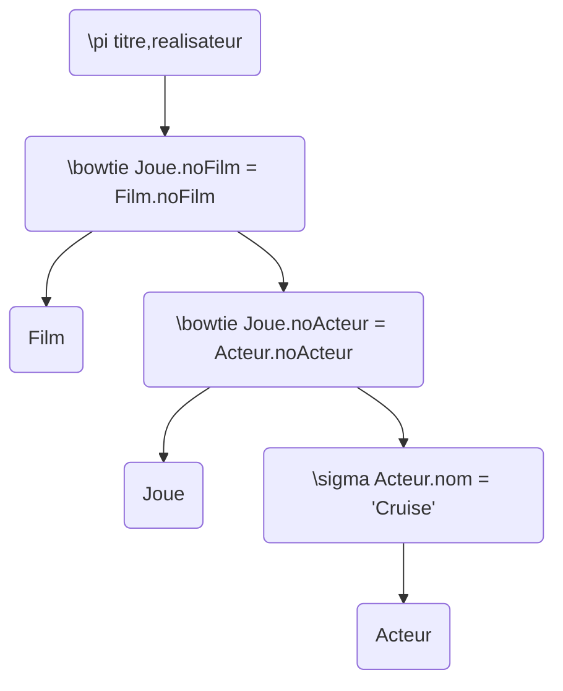

# Compilation de requêtes

## Partie I : Questions de cours

Dans les questions Q1, Q2 et Q3 vous pouvez cocher une ou plusieurs réponses. Pour chacune de ces questions si vous oubliez de cocher une case ou si vous cochez une case de manière erronée la réponse sera considérée comme fausse.

### Q1. Quels sont les composants participant au processus de compilation d'une requête ?

- [x] Optimiseur (Optimiser)
- [x] Analyseur syntaxique (Syntax analyser)
- [ ] Table des symboles (Table of symbols)
- [x] Méta-base (Meta-base)
- [x] Analyseur sémantique (Semantic analyser)
- [x] Exécuteur (Execution engine)
- [x] Contrôleur (Controller)

### Q2. Quel est l'algorithme le plus performant pour réaliser la jointure de 2 relations ?

- [ ] Jointure par produit cartésien (Nested Loops Join)
- [ ] Jointure par hachage (Hash Join)
- [x] Jointure par tri-fusion (Sort-Merge Join)
- [ ] Aucun (None)

### Q3. Quel algorithme de jointure doit obligatoirement être implémenté dans un SGBD ?

- [x] Jointure par produit cartésien (Nested Loops Join)
- [ ] Jointure par hachage (Hash Join)
- [ ] Jointure par tri-fusion (Sort-Merge Join)
- [ ] Aucun (None)

## Partie II : Exercices

Soit le schéma relationnel suivant :

- Film (<ins>noFilm</ins>, titre, type, realisateur, date_sortie) \
  Cette relation décrit les films produits par une société. Un film est reconnu par un numéro, un titre, un type (comédie, horreur, ...), un réalisateur (son nom) et la date de sortie.

- Acteur (<ins>noActeur</ins>, nom, prenom, age, sexe) \
  Cette relation décrit les acteurs. Un acteur est reconnu par un numéro, il a un nom, un prénom, un âge et c'est un homme ou une femme.

- Joue (<ins>noActeur, noFilm</ins>, role, cachet) \
  Cette relation donne l'acteur (noActeur) jouant dans un film (noFilm), le rôle de l'acteur dans le film
  (principal ou secondaire) et le cachet reçu par l'acteur pour ce film.

Les attributs soulignés, dans une relation, constituent une clé. Les caractéristiques physiques des relations Film, Acteur et Joue sont décrites dans le tableau ci-dessous.

| Attribut                                                     | Taille en caractères |
| ------------------------------------------------------------ | -------------------- |
| noFilm, noActeur, type, date_sortie, age, sexe, role, cachet | 10 chacun            |
| titre, realisateur, nom, prenom                              | 35 chacun            |

| Nom de relation | Nombre de tuples |
| --------------- | ---------------- |
| Film            | F                |
| Acteur          | A                |
| Joue            | J                |

### Q1.

Nous supposons que l'organisation de chaque fichier implémentant une relation est relative et que sur toutes les clés primaires, il existe un index en B-arbre. Calculer le nombre de pages disques lues des requêtes suivantes :

- La date de sortie du film intitulé « Minority Report » réalisé par Spielberg.
- Le titre du film dont le numéro est le $ 10536 $.

De plus, nous supposons que : (i) la taille d'une page disque est de $ 1000 $ caractères et (ii) la taille d'un pointeur de page est de $ 15 $ caractères. Pour cette question, nous supposons également F = $ 100 000 $.

Pour la première requête, pour recuperer la date de sortie du film intitulé « Minority Report » réalisé par Spielberg. \

- $ 100 000 \times 100 = 10 000 000 $
- $ 1000 $ caractères par page
- $ 10 000 000 / 1000 = 10 000 $

Il faut donc lire $ 10 000 $ pages.

Pour la deuxième requête, pour recuperer le titre du film dont le numéro est le 10536. \
Nombre de pages par index :

- Index plein : $ 100000 \times (10 + 15) / 1000 = 2500 $
- Index creux $1^{er}$ niveau : $ 2500 \times (10 + 15) / 1000 = 62.5 = 63 $
- Index creux $2^{nd}$ niveau : $ 63 \times (10 + 15) / 1000 = 1.575 = 2 $
- Index creux $3^{rd}$ niveau : $ 2 \times (10 + 15) / 1000 = 0.03 < 1 $ (on ne lit pas la page, on s'arrête ici)

Il faut donc lire $ 5 $ pages.

### Q2.

En utilisant les opérateurs de l'algèbre relationnelle, donner 2 arbres algébriques (un arbre optimisé et l'autre non optimisé sans utiliser l'opérateur de projection à l'exception de l'affichage du résultat final) répondant à la question suivante :

Donner les titres et les réalisateurs des films dans lesquels Tom Cruise a joué.

Arbre non optimisé :

Arbre optimisé :

### Q3.

Estimer le volume de données accédées et manipulées par les 2 arbres algébriques exprimés à la question Q2. Pour cette question, nous supposons que Tom Cruise a joué dans X films.

(A \* 100) + (J \* 40) + (A /
