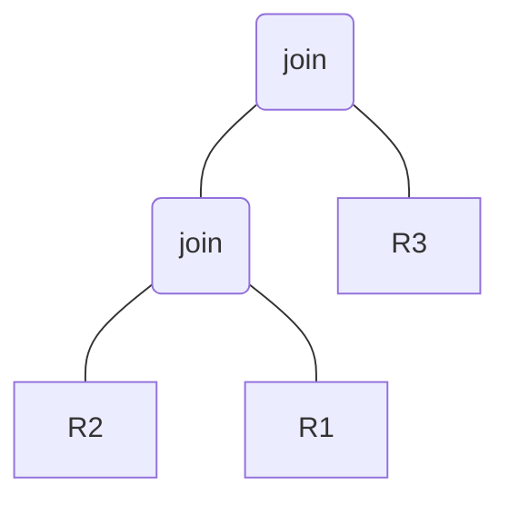
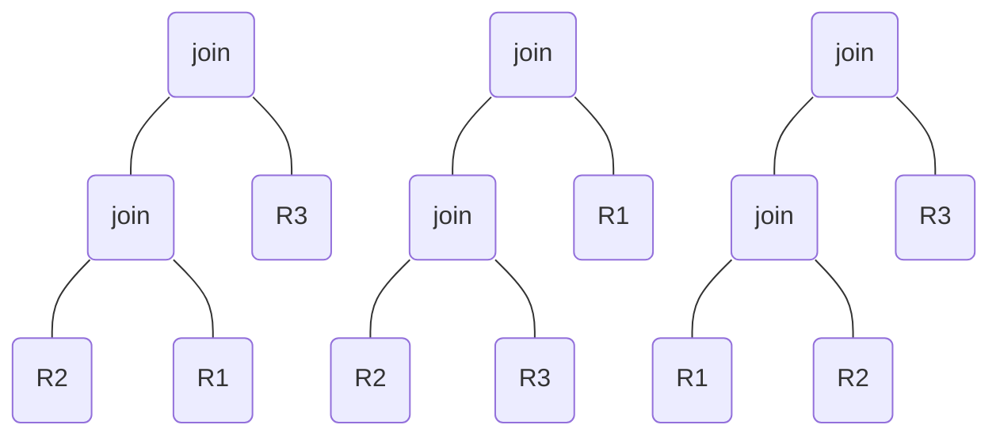

## Optimisation physique

Select \
From R1, R2, R3 \
Where R1.a = R2.b and R2.c = R3.d

Trace d'execution de HA :\
Hypotheses R2 est la plus petite relation. R2 relation pivot et $|R2 \infty R1| < |R2| \infty |R1|$

### HA

1. Stratégie de recherche en profondeur d'abord HA \
   arbre = {R2} \
   courant = {R2} \
   arbre = $\empty$ \
   succ = {R2 \* R1, R2 \* R3} \
   succ = {R2 \* R1} \
   arbre = {R2 \* R1}
2. courant = {R2 \* R1} \
   arbre = $\empty$ \
   succ = {(R2 \* R1) \* R3} \
   succ = {(R2 \* R1) \* R3} \
   arbre = {(R2 \* R1) \* R3}
3. courant = {(R2 \* R1) \* R3} \
   arbre = $\empty$ \
   courant est un arbre complet resultat = (R2 \* R1) \* R3

join = $\infty$

HA produit 1 arbre et le HA\* produit plusieurs arbres

### HA\*

arbre = {R2}

1. courant = {R2} \
    arbre = {R1, R3} \
   sinon succ = {R2 \* R1, R2 \* R3} \
    succ = {R2 \* R1} \
    arbre = {R1, R3, R2 \* R1}
2. courant = {R2 \* R1} \
   arbre = {R1, R3} \
   sinon succ = {(R2 \* R1) \* R3} \
   succ = {(R2 \* R1) \* R3} \
   arbre = {R1, R3, (R2 \* R1) \* R3}
3. courant = {(R2 \* R1) \* R3} \
   arbre = {R1, R3} \
   courant = arbre complet => resultat = (R2 \* R1) \* R3
4. courant = {R1} \
   arbre = {R3} \
   sinon succ = {R1 \* R2} \
   succ = {R1 \* R2} \
   arbre = {R3, R1 \* R2} \
5. courant = {R1 \* R2} \
   arbre = {R3} \
   sinon succ = {(R1 \* R2) \* R3} \
   succ = {(R1 \* R2) \* R3} \
   arbre = {R3, (R1 \* R2) \* R3} \
6. courant = {(R1 \* R2) \* R3} \
   arbre = {R3} \
   courant = arbre complet => resultat = (R2 \* R1) \* R3 $\cup$ (R1 \* R2) \* R3
7. courant = {R3} \
   arbre = $\empty$ \
   sinon succ = {R3 \* R1} \
   succ = {R3 \* R1} \
   arbre = {R3 \* R1}
8. courant = {R3 \* R1} \
   arbre = $\empty$ \
   sinon succ = {(R3 \* R1) \* R2} \
   succ = {(R3 \* R1) \* R2} \
   arbre = {(R3 \* R1) \* R2}
9. courant = {(R3 \* R1) \* R2} \
   arbre = $\empty$ \
   courant = arbre complet => resultat = (R2 \* R1) \* R3 $\cup$ (R1 \* R2) \* R3 $\cup$ (R3 \* R1) \* R2

join = $\infty$

## Recherche en largeur d'abord

arbre = {R1, R2, R3}

1. courant = {R1} \
   arbre = {R2, R3} \
   sinon succ = {R1 \* R2} \
    succ = {R1 \* R2} \
    arbre = {R2, R3, R1 \* R2}
2. courant = {R2} \
   arbre = {R3, R1 \* R2} \
   sinon succ = {R2 \* R1, R2 \* R3} \
   succ = {R2 \* R1, R2 \* R3} \
   arbre = {R3, R1 \* R2, R2 \* R1, R2 \* R3}
3. courant = {R3} \
   arbre = {R1 \* R2, R2 \* R1, R2 \* R3} \
   succ = {R3 \* R2} \
   arbre = {R1 \* R2, R2 \* R1, R2 \* R3, R3 \* R1}
   ...
